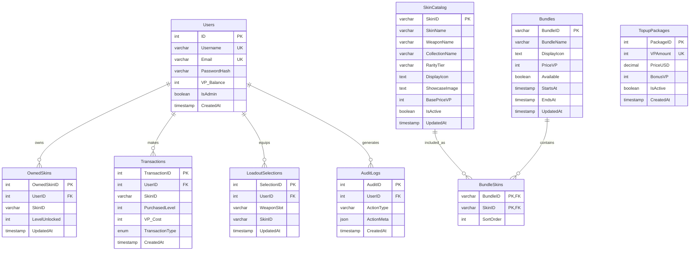

# Valorant E-Commerce Platform Database Report

## 1. Project Overview

**Project name:** Valorant In-Game Shop Replica.

This build is a game-commerce web application that recreates a Valorant-style digital item shop. The platform sells virtual weapon skins, featured bundles, and Valorant Points (VP) top-up packages. The current frontend is built with Next.js App Router and Tailwind CSS, while the backend uses Next.js API routes that call MySQL stored procedures for transactional purchase and loadout operations.

**Target market:** Valorant players and game-commerce users who want a fast, familiar storefront for browsing skins, buying bundles, topping up currency, and managing their equipped loadout.

**Products and services:**

| Product / Service | Description | Current implementation |
|---|---|---|
| Weapon skins | Individual cosmetic gun skins sold for VP. | `SkinCatalog`, `OwnedSkins`, `ProcessSkinPurchase`, `/api/purchase-skin` |
| Bundles | A collection of skins purchased as one offer. | `Bundles`, `BundleSkins`, `ProcessBundlePurchase`, `/api/purchase-bundle` |
| VP top-ups | Digital currency packages used to buy skins and bundles. | `TopupPackages`, `ProcessTopup`, `/api/topup` |
| Loadout selections | Equipped skin per weapon slot. | `LoadoutSelections`, `SaveLoadoutSelection`, `/api/loadout` |
| Admin account management | Admin-only user creation, password updates, deletion, and transaction review. | `Users.IsAdmin`, `/api/admin/*` routes |

**Core user types:**

1. **Guest / visitor** - browses the shop UI before logging in or creating an account.
2. **Customer / player** - signs up or logs in, tops up VP, buys skins/bundles, and saves loadouts.
3. **Admin** - verifies with the seeded admin account, reviews transactions, creates accounts, changes passwords, and deletes users.

---

## 2. Database Schema & Design

The ERD below contains 9 tables. Primary keys are marked `PK`; foreign keys are marked `FK`.



### 2.1 Normalization Justification

The schema is designed to satisfy **3NF** and, for the main relationship tables, **BCNF**:

- **1NF:** All tables store atomic values. For example, user data is separated into username, email, password hash, VP balance, and admin flag. Bundle contents are not stored as comma-separated lists; the M:N bundle-to-skin relationship is normalized through `BundleSkins`.
- **2NF:** Non-key attributes depend on a complete key. In `BundleSkins`, the composite primary key is `(BundleID, SkinID)`, and `SortOrder` describes that exact bundle-skin pairing rather than only a bundle or only a skin.
- **3NF:** Non-key attributes do not depend on other non-key attributes. For example, `Users` stores account data only, `TopupPackages` stores VP package metadata only, and `Transactions` stores purchase/top-up events without duplicating username or email.
- **BCNF:** Determinants are candidate keys in the central tables. `Users.Username` and `Users.Email` are unique candidate keys; `OwnedSkins` enforces one row per `(UserID, SkinID)`; `LoadoutSelections` enforces one equipped skin per `(UserID, WeaponSlot)`; `BundleSkins` uses a composite key to represent bundle membership.
- **M:N handling:** Bundles and skins are many-to-many because one bundle contains many skins and one skin can appear in multiple bundles. This is implemented with the join table `BundleSkins(BundleID, SkinID)` instead of repeating skin columns inside `Bundles`.

---

## 3. Advanced SQL Implementation

### 3.1 Stored Procedures

The build uses transactional stored procedures so VP balance updates, ownership changes, and transaction records succeed or roll back as a unit.

```sql
DROP PROCEDURE IF EXISTS ProcessSkinPurchase $$
CREATE PROCEDURE ProcessSkinPurchase(
  IN p_user_id INT,
  IN p_skin_id VARCHAR(100),
  IN p_level INT,
  IN p_vp_cost INT
)
BEGIN
  DECLARE current_vp INT;

  DECLARE EXIT HANDLER FOR SQLEXCEPTION
  BEGIN
    ROLLBACK;
    RESIGNAL;
  END;

  START TRANSACTION;

  SELECT VP_Balance INTO current_vp
  FROM Users
  WHERE ID = p_user_id
  FOR UPDATE;

  IF current_vp IS NULL THEN
    SIGNAL SQLSTATE '45000' SET MESSAGE_TEXT = 'User does not exist';
  END IF;

  IF p_vp_cost < 0 OR p_level <= 0 THEN
    SIGNAL SQLSTATE '45000' SET MESSAGE_TEXT = 'Invalid purchase payload';
  END IF;

  IF current_vp < p_vp_cost THEN
    SIGNAL SQLSTATE '45000' SET MESSAGE_TEXT = 'Insufficient VP balance';
  END IF;

  UPDATE Users
  SET VP_Balance = VP_Balance - p_vp_cost
  WHERE ID = p_user_id;

  INSERT INTO OwnedSkins (UserID, SkinID, LevelUnlocked)
  VALUES (p_user_id, p_skin_id, p_level)
  ON DUPLICATE KEY UPDATE LevelUnlocked = GREATEST(LevelUnlocked, VALUES(LevelUnlocked));

  INSERT INTO Transactions (UserID, SkinID, PurchasedLevel, VP_Cost, TransactionType)
  VALUES (p_user_id, p_skin_id, p_level, p_vp_cost, 'PURCHASE');

  COMMIT;
END $$
```

Other stored procedures in the build:

| Procedure | Purpose | Transaction logic |
|---|---|---|
| `StartShopSession` | Creates/fetches a player session account. | Uses `START TRANSACTION`, `COMMIT`, and `ROLLBACK` handler. |
| `ProcessTopup` | Adds VP and records a `TOPUP` transaction. | Locks the user row with `FOR UPDATE`. |
| `ProcessBundlePurchase` | Deducts VP, loops through JSON skin IDs, grants bundle skins, and records a `BUNDLE` transaction. | Rolls back the whole bundle if any validation fails. |
| `SaveLoadoutSelection` | Saves one equipped skin per weapon slot. | Verifies ownership before insert/update. |

### 3.2 Stored Functions

```sql
DROP FUNCTION IF EXISTS CheckTotalVP $$
CREATE FUNCTION CheckTotalVP(p_user_id INT)
RETURNS INT
READS SQL DATA
DETERMINISTIC
BEGIN
  DECLARE total_vp INT;
  SELECT VP_Balance INTO total_vp FROM Users WHERE ID = p_user_id;
  RETURN IFNULL(total_vp, 0);
END $$

DROP FUNCTION IF EXISTS RecommendedTopupVP $$
CREATE FUNCTION RecommendedTopupVP(p_needed_vp INT)
RETURNS INT
DETERMINISTIC
BEGIN
  DECLARE need_vp INT DEFAULT GREATEST(IFNULL(p_needed_vp, 0), 0);

  IF need_vp <= 475 THEN RETURN 475; END IF;
  IF need_vp <= 1000 THEN RETURN 1000; END IF;
  IF need_vp <= 2050 THEN RETURN 2050; END IF;
  IF need_vp <= 3650 THEN RETURN 3650; END IF;
  IF need_vp <= 5350 THEN RETURN 5350; END IF;
  RETURN 11000;
END $$

DROP FUNCTION IF EXISTS CountOwnedSkins $$
CREATE FUNCTION CountOwnedSkins(p_user_id INT)
RETURNS INT
READS SQL DATA
DETERMINISTIC
BEGIN
  DECLARE owned_count INT;
  SELECT COUNT(*) INTO owned_count FROM OwnedSkins WHERE UserID = p_user_id;
  RETURN IFNULL(owned_count, 0);
END $$
```

### 3.3 Triggers

The build includes audit logging triggers plus validation triggers that prevent invalid loadout inventory selections.

```sql
DROP TRIGGER IF EXISTS trg_transactions_audit $$
CREATE TRIGGER trg_transactions_audit
AFTER INSERT ON Transactions
FOR EACH ROW
BEGIN
  INSERT INTO AuditLogs (UserID, ActionType, ActionMeta)
  VALUES (
    NEW.UserID,
    CONCAT('TRANSACTION_', NEW.TransactionType),
    JSON_OBJECT('skinId', NEW.SkinID, 'vpCost', NEW.VP_Cost, 'level', NEW.PurchasedLevel)
  );
END $$

DROP TRIGGER IF EXISTS trg_loadout_before_insert $$
CREATE TRIGGER trg_loadout_before_insert
BEFORE INSERT ON LoadoutSelections
FOR EACH ROW
BEGIN
  IF NOT EXISTS (
    SELECT 1 FROM OwnedSkins
    WHERE UserID = NEW.UserID AND SkinID = NEW.SkinID
  ) THEN
    SIGNAL SQLSTATE '45000' SET MESSAGE_TEXT = 'Cannot equip skin that is not owned';
  END IF;
END $$

DROP TRIGGER IF EXISTS trg_loadout_audit_update $$
CREATE TRIGGER trg_loadout_audit_update
AFTER UPDATE ON LoadoutSelections
FOR EACH ROW
BEGIN
  INSERT INTO AuditLogs (UserID, ActionType, ActionMeta)
  VALUES (
    NEW.UserID,
    'LOADOUT_SWITCH',
    JSON_OBJECT('weaponSlot', NEW.WeaponSlot, 'oldSkinId', OLD.SkinID, 'newSkinId', NEW.SkinID)
  );
END $$
```

### 3.4 Indexing

| Index / key | Table | Columns | Purpose |
|---|---|---|---|
| `PRIMARY KEY` | `Users` | `ID` | Fast user lookup by account ID. |
| `UNIQUE` | `Users` | `Username`, `Email` | Prevents duplicate accounts and speeds login/admin lookup. |
| `idx_skin_catalog_weapon` | `SkinCatalog` | `WeaponName` | Speeds filtering skins by weapon slot. |
| `idx_skin_catalog_collection` | `SkinCatalog` | `CollectionName` | Speeds catalog grouping by collection. |
| `idx_bundles_available` | `Bundles` | `Available`, `EndsAt` | Speeds lookup of active offers. |
| `PRIMARY KEY` | `BundleSkins` | `BundleID`, `SkinID` | Enforces one skin membership per bundle and supports bundle expansion. |
| `idx_bundle_skins_skin` | `BundleSkins` | `SkinID` | Speeds reverse lookup of bundles containing a skin. |
| `unique_user_skin` | `OwnedSkins` | `UserID`, `SkinID` | Prevents duplicate ownership rows and supports purchase upsert. |
| `idx_owned_skins_skin` | `OwnedSkins` | `SkinID` | Speeds ownership checks by skin. |
| `unique_user_slot` | `LoadoutSelections` | `UserID`, `WeaponSlot` | Enforces one equipped skin per user weapon slot. |
| `idx_audit_user` | `AuditLogs` | `UserID` | Speeds admin audit lookup for one account. |

---

## 4. Security and Data Control (DCL)

The application already distinguishes admins from normal players with `Users.IsAdmin` and stores only bcrypt password hashes. The SQL below can be run by a DBA to create database-level roles that match the application roles.

```sql
CREATE ROLE IF NOT EXISTS 'shop_admin';
CREATE ROLE IF NOT EXISTS 'shop_customer';
CREATE ROLE IF NOT EXISTS 'shop_guest';

GRANT ALL PRIVILEGES ON valorant_shop.* TO 'shop_admin';

GRANT SELECT ON valorant_shop.SkinCatalog TO 'shop_guest';
GRANT SELECT ON valorant_shop.Bundles TO 'shop_guest';
GRANT SELECT ON valorant_shop.BundleSkins TO 'shop_guest';
GRANT SELECT ON valorant_shop.TopupPackages TO 'shop_guest';

GRANT SELECT, UPDATE ON valorant_shop.Users TO 'shop_customer';
GRANT SELECT, INSERT, UPDATE ON valorant_shop.OwnedSkins TO 'shop_customer';
GRANT SELECT, INSERT ON valorant_shop.Transactions TO 'shop_customer';
GRANT SELECT, INSERT, UPDATE ON valorant_shop.LoadoutSelections TO 'shop_customer';
GRANT EXECUTE ON PROCEDURE valorant_shop.StartShopSession TO 'shop_customer';
GRANT EXECUTE ON PROCEDURE valorant_shop.ProcessTopup TO 'shop_customer';
GRANT EXECUTE ON PROCEDURE valorant_shop.ProcessSkinPurchase TO 'shop_customer';
GRANT EXECUTE ON PROCEDURE valorant_shop.ProcessBundlePurchase TO 'shop_customer';
GRANT EXECUTE ON PROCEDURE valorant_shop.SaveLoadoutSelection TO 'shop_customer';
GRANT EXECUTE ON FUNCTION valorant_shop.CheckTotalVP TO 'shop_customer';
GRANT EXECUTE ON FUNCTION valorant_shop.RecommendedTopupVP TO 'shop_customer';
GRANT EXECUTE ON FUNCTION valorant_shop.CountOwnedSkins TO 'shop_customer';

REVOKE INSERT, UPDATE, DELETE ON valorant_shop.AuditLogs FROM 'shop_customer';
REVOKE INSERT, UPDATE, DELETE ON valorant_shop.Users FROM 'shop_guest';
REVOKE INSERT, UPDATE, DELETE ON valorant_shop.Transactions FROM 'shop_guest';
```

---

## 5. CRUD Verification & Testing

The following verification script demonstrates Create, Read, Update, and Delete operations across the main entities without relying on screenshots. Run it after `sql/init_valorant_shop.sql` in a local MySQL/XAMPP database.

```sql
-- CREATE: create a test customer.
CALL StartShopSession('crud_user', 'crud@valora.local', '$2b$10$G0RqbuYPI8S9fGYY2idbHuAVRzyqGU.T1lKDuYY0PEC41O.2AJuka', 3000, @crud_user_id, @crud_current_vp);
SELECT @crud_user_id AS CreatedUserID, @crud_current_vp AS StartingVP;

-- CREATE: purchase a skin through the transactional purchase procedure.
CALL ProcessSkinPurchase(@crud_user_id, 'test_vandal_skin', 1, 875);

-- READ: verify balance, owned skin count, and transaction rows.
SELECT UserID, Username, VP_Balance, OwnedSkinCount, TotalSpentVP
FROM v_user_commerce_summary
WHERE UserID = @crud_user_id;

SELECT OwnedSkinID, UserID, SkinID, LevelUnlocked
FROM OwnedSkins
WHERE UserID = @crud_user_id;

-- UPDATE: upgrade ownership level and save a loadout selection.
CALL ProcessSkinPurchase(@crud_user_id, 'test_vandal_skin', 2, 10);
CALL SaveLoadoutSelection(@crud_user_id, 'Vandal', 'test_vandal_skin');

SELECT UserID, WeaponSlot, SkinID
FROM LoadoutSelections
WHERE UserID = @crud_user_id;

-- DELETE: remove the test data in dependency order.
DELETE FROM LoadoutSelections WHERE UserID = @crud_user_id;
DELETE FROM OwnedSkins WHERE UserID = @crud_user_id;
DELETE FROM Transactions WHERE UserID = @crud_user_id;
DELETE FROM AuditLogs WHERE UserID = @crud_user_id;
DELETE FROM Users WHERE ID = @crud_user_id;

SELECT COUNT(*) AS RemainingCrudUsers
FROM Users
WHERE Username = 'crud_user';
```

Expected query result highlights:

| Step | Expected result |
|---|---|
| Create user | `CreatedUserID` is non-null and `StartingVP = 3000`. |
| Purchase skin | `OwnedSkins` contains `test_vandal_skin` for the new user. |
| Read summary | `VP_Balance` decreases, `OwnedSkinCount >= 1`, and `TotalSpentVP > 0`. |
| Update loadout | `LoadoutSelections` contains weapon slot `Vandal`. |
| Delete cleanup | `RemainingCrudUsers = 0`. |

---

## 6. Curriculum Vitae (Resume)

> Replace the bracketed values with the developer's real information before submission.

**[Your Name]**  
Database / Full-Stack Developer  
[Email] · [Phone] · [Portfolio or GitHub]

### Profile

Full-stack developer experienced in building a database-backed e-commerce web application with Next.js, MySQL, stored procedures, triggers, and role-based account management. Implemented transactional purchase flows, audit logging, normalized tables, secure password hashing, and admin CRUD tools.

### Technical Skills

- **Frontend:** Next.js App Router, React, TypeScript, Tailwind CSS, Framer Motion.
- **Backend:** Next.js API routes, MySQL connection pooling, server-side authentication checks.
- **Database:** MySQL/MariaDB, ERD design, 3NF/BCNF normalization, stored procedures, stored functions, triggers, views, DCL roles, indexes.
- **Security:** bcrypt password hashing, admin role flags, least-privilege database role design.

### Project Experience

**Valorant In-Game Shop Replica — Database and Full-Stack Developer**

- Designed a 9-table e-commerce schema for users, catalog skins, bundles, VP packages, purchases, owned inventory, loadouts, and audit logs.
- Implemented transactional purchase logic using `START TRANSACTION`, row locks, `COMMIT`, and `ROLLBACK` handlers.
- Added audit and validation triggers to track transaction/loadout events and prevent equipping unowned skins.
- Built admin-facing account management APIs for creating users, updating passwords, deleting accounts, and reviewing transactions.
- Created normalized bundle-to-skin join table to represent M:N product relationships cleanly.

### Education

**[School / University]** — [Program or Degree]  
[Start Year] - [End Year]

### References

Available upon request.
