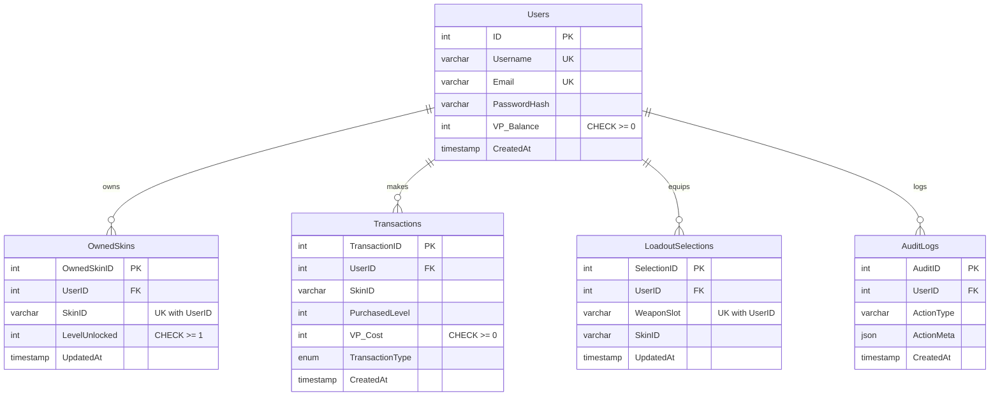

# Valorant Shop ERD

## Notes
- `OwnedSkins` stores all purchased skins for each user, with uniqueness on `(UserID, SkinID)`.
- `Transactions` stores topups and purchases (`PURCHASE`, `BUNDLE`, `TOPUP`).
- `LoadoutSelections` stores equipped skin per weapon slot per user, with uniqueness on `(UserID, WeaponSlot)`.
- `AuditLogs` stores trigger-based transaction/loadout audit entries.
- `UpgradePricing` was removed from the schema.

## DB Logic Layer (from `init_valorant_shop.sql`)

### Stored Functions
- `CheckTotalVP(p_user_id)`
- `RecommendedTopupVP(p_needed_vp)`
- `CountOwnedSkins(p_user_id)`

### Stored Procedures
- `StartShopSession(...)`
- `ProcessTopup(...)`
- `ProcessSkinPurchase(...)`
- `ProcessBundlePurchase(...)`
- `SaveLoadoutSelection(...)`

### Triggers
- `trg_transactions_audit` (AFTER INSERT on `Transactions`)
- `trg_loadout_before_insert` (BEFORE INSERT on `LoadoutSelections`)
- `trg_loadout_before_update` (BEFORE UPDATE on `LoadoutSelections`)
- `trg_loadout_audit_insert` (AFTER INSERT on `LoadoutSelections`)
- `trg_loadout_audit_update` (AFTER UPDATE on `LoadoutSelections`)
