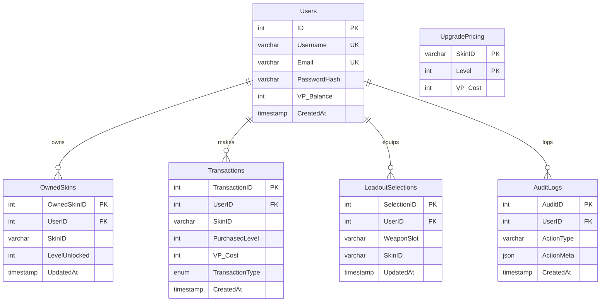

# Valorant Shop ERD

## Notes
- `OwnedSkins` stores all purchased skins for each user.
- `Transactions` stores topups and purchases (`PURCHASE`, `BUNDLE`, `TOPUP`).
- `LoadoutSelections` stores equipped skin per weapon slot per user.
- `AuditLogs` stores trigger-based transaction audit entries.
